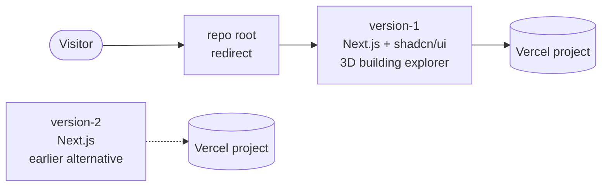

<p align="center">
  
</p>

<h1 align="center">design-piche</h1>

<p align="center">
  Implementations of the <a href="https://piche.lv">PICHE</a> home page — a Latvian
  real-estate developer's marketing site. <strong>Version 1 is the live build</strong>;
  version 2 is kept as an earlier alternative take.
</p>

<p align="center">
  
  
  
  
  
  
</p>

---

## How it fits together



Each version is a fully separate Next.js app that deploys as its own Vercel
project. The repo root no longer serves a page of its own — it redirects
straight to version 1.

## Layout

| Path | What it is |
|---|---|
| [`vercel.json`](vercel.json) | Root redirect — sends every request to the version 1 deployment |
| [`version-1/`](version-1) | The live build: Next.js + shadcn/ui, including an interactive 3D building explorer |
| [`version-2/`](version-2) | Earlier alternative build, also with an interactive 3D building explorer |

Both share the same brief (see
[`version-1/PRODUCT.md`](version-1/PRODUCT.md)) — a calm, trustworthy site
where photography and real project data (prices, floor counts, availability)
do the persuading, built around two moments that matter: exploring a
building and completing the contact form.

## Running locally

Each version is a standalone app — install and run from inside its folder:

```bash
cd version-1   # or version-2
npm install
npm run dev
```

Then open [http://localhost:3000](http://localhost:3000).

## Deployment

Each version deploys as its own Vercel project with **Root Directory** set to
that folder (`version-1` or `version-2`). The repo-root project carries no page
of its own — [`vercel.json`](vercel.json) redirects every path (307, temporary)
to `piche-version-1.vercel.app`, so visitors land on version 1 immediately.

To point the root at a different build later, change the `destination` in
`vercel.json`.

## License

MIT — see [LICENSE](LICENSE).
