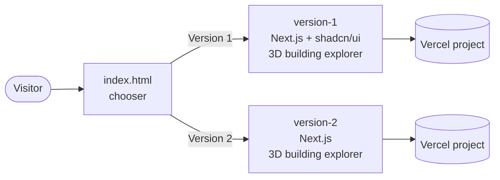

<p align="center">
  
</p>

<h1 align="center">design-piche</h1>

<p align="center">
  Two independent implementations of the <a href="https://piche.lv">PICHE</a> home page —
  a Latvian real-estate developer's marketing site — built side by side so the
  customer can compare and choose one.
</p>

<p align="center">
  
  
  
  
  
  
</p>

---

## How it fits together



Each version is a fully separate Next.js app that deploys as its own Vercel
project. The chooser is a single static page deployed from the repo root that
previews both live sites side by side and links to whichever one is picked.

## Layout

| Path | What it is |
|---|---|
| [`index.html`](index.html) | Split-screen chooser with live previews of both versions |
| [`version-1/`](version-1) | Next.js + shadcn/ui build, including an interactive 3D building explorer |
| [`version-2/`](version-2) | Next.js build, independently built, also with an interactive 3D building explorer |

Both versions share the same brief (see
[`version-1/PRODUCT.md`](version-1/PRODUCT.md)) — a calm, trustworthy site
where photography and real project data (prices, floor counts, availability)
do the persuading, built around two moments that matter: exploring a
building and completing the contact form.

## Running locally

Each version is a standalone app — install and run from inside its folder:

```bash
cd version-1   # or version-2
npm install
npm run dev
```

Then open [http://localhost:3000](http://localhost:3000).

## Deployment

Each version deploys as its own Vercel project with **Root Directory** set to
that folder (`version-1` or `version-2`). The chooser (`index.html`) deploys
separately from the repo root and links to both live URLs.

## License

MIT — see [LICENSE](LICENSE).
